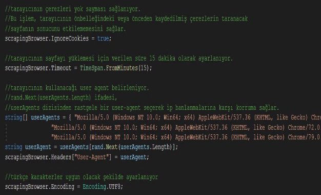
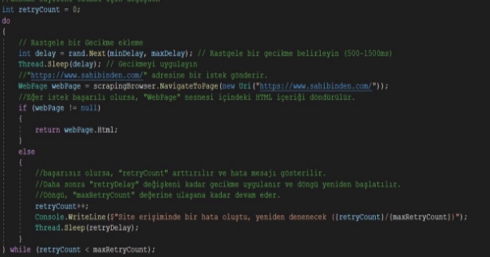
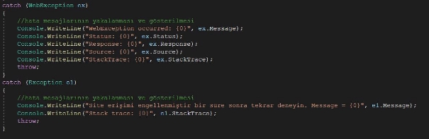
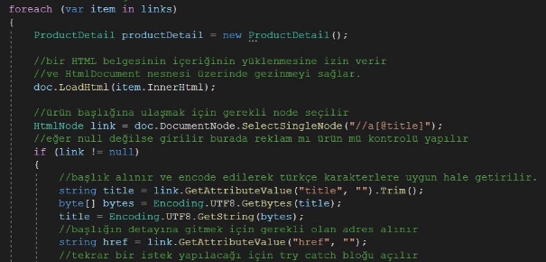
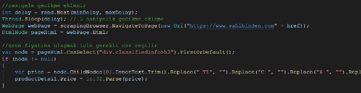
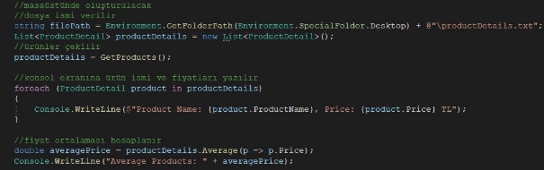
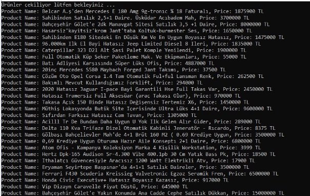
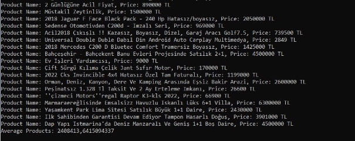

`    `**Problem Sahibinden.com sitesinde ana sayfa vitrinindeki ilanların ismini ve ilanların fiyat bilgisini çekmek, bunları arayüzde göstermek ve olası ip banlamalarına karşı korunmaktan oluşuyor.** 

**Bu problemi çözmek için öncelikle siteye istek göndermek ve verileri çekmek için ScrapySharp kütüphanesi kullanıldı ScrapySharp kütüphanesinin bir ürünü olan ScrapingBrowser kullanılarak siteye istek atmadan önce gerekli ayarlamalar yapıldı bu ayarlamaların detayı yorum satırlarında gözüküyor.** 

`    `**Siteye istek denemelerinin sayısının tutulması ve maximum deneme sayısı aşıldıysa denemeyi bırakmak için retryCount ve maxRetryCount adında iki değişken tutuluyor. IP banlamarından kaçınmak için siteye istek atmadan önce rastgele bekleme süreleri konuldu. ScrapingBrowser ile siteye istek atılır ve başarılı olursa sitenin HTML’İ fonksiyondan döndürülür.** 

**Eğer hata oluşursa yakalamak için try/catch blokları konuldu.** 

**Siteden html çekilerek istenen vitrin ilanlarının olduğu css seçiliyor** 

**Vitrindeki ürünler tek tek gezilerek başlıkları ve detay adresleri alınır. Karakterler Encode edilerek Türkçe karakter hatası çözülür.** 

**Detay adresine istek atmadan önce yine banlanma ihtimalini azaltmak için gecikme eklenir ve detay sitesine erişim isteğinde bulunularak ilgili css’den fiyat bilgisi çekilir.** 

**Dosya işlemleri için dosya yolu verilir. Ürünler ve ortalama fiyat konsola yazdırılır.** 

**Ürün detayları dosyaya yazılır.** 

**ÇIKTILAR** 

